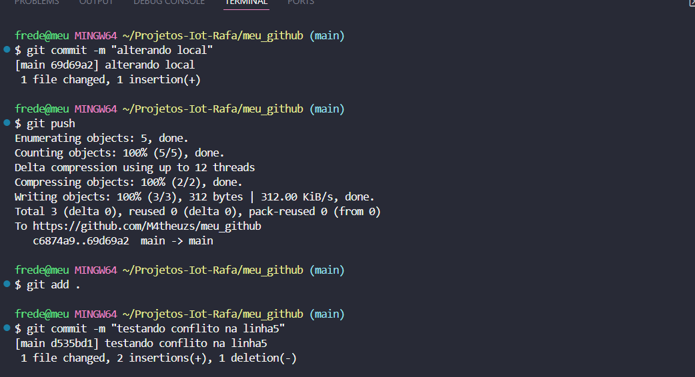

# meu_github
# meu git remoto altercao
# de novo remoto
alterando linha4 local
alterando linha5 local

##Merge de Branch & Pull Request

A primeira imagem (merge1.png) documenta a fase inicial de um fluxo de trabalho com Git, mostrando um processo de desenvolvimento normal antes de qualquer conflito ocorrer. Esta sequência de comandos demonstra o ciclo básico do versionamento: fazer alterações locais, registrar essas alterações com commits e enviá-las para o repositório remoto.

Análise dos Comandos:
Commit Inicial:
O comando git commit -m "alterando local" registra as modificações feitas no código com uma mensagem descritiva. O Git confirma que o commit foi criado no branch main com o identificador único parcial 69d69a2 e informa que um arquivo foi alterado com uma adição de linha.

Push para o Repositório Remoto:
O comando git push inicia o processo de enviar os commits locais para o servidor remoto. O Git detalha o processo de empacotamento e envio dos arquivos, mostrando que três objetos foram enviados com sucesso. A linha final confirma que a referência no repositório remoto foi atualizada do commit c6874a9 para 69d69a2.

Preparação de Novas Alterações:
O comando git add . adiciona todas as modificações atuais à área de staging, preparando-as para serem incluídas no próximo commit.

Segundo Commit:
Um novo commit é criado com git commit -m "testando conflito na linhas", registrando outra etapa do desenvolvimento. Desta vez, o Git informa que um arquivo foi modificado com duas linhas adicionadas e uma linha removida.